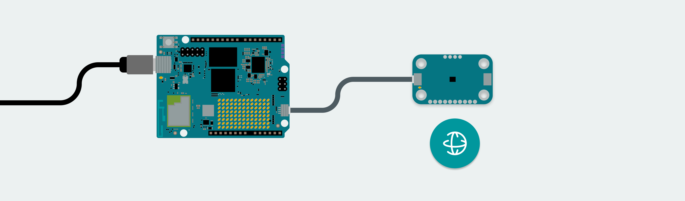
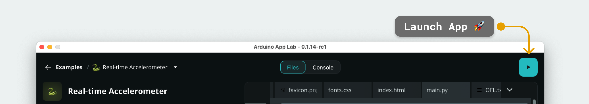

# Real Time Accelerometer Data

The **Real Time Accelerometer Data** example records accelerometer data from the [Modulino® Movement](https://store.arduino.cc/products/modulino-movement) node, and streams it to a web interface.

The accelerometer data recorded from the Modulino® is then processed by a pre-trained model that classifies different types of movement.

## Bricks Used

- `motion_detection` - processes accelerometer data to identify specific motion patterns, using a pre-trained model.
- `web_ui` - used to host a web server on the board, serving HTML, CSS & JavaScript files.

## AI Model Used

The model used for this example is trained by the Edge Impulse team: 

The pre-built dataset features four types of movement:
- **Up and down movement** - move the board up and down (lift it and put it down)
- **Snake movement** - move the board across a desk like a snake
- **Wave movement** - move the board left and right in a hand waving motion 
- **Idle** - no movement recorded

To read more about the model, visit the following link:
- [Motion Classification - Continuous Motion Recognition](https://studio.edgeimpulse.com/public/497631/latest)

## Hardware and Software Requirements

### Hardware

- Arduino® UNO Q
- USB-C® cable
- [Modulino® Movement](https://store.arduino.cc/products/modulino-movement)
- Qwiic cable

### Software

- Arduino App Lab

## How to Use the Example

1. Connect the board to a computer using a USB-C® cable.
2. Connect the Modulino® Movement to the board using the Qwiic connector.
    

3. Launch the App by clicking on the "Play" button in the top right corner. Wait until the App has launched.
    

4. Open a browser and access `<UNO-Q-IP-ADDRESS>:7000` (this may also launch automatically).
5. View the data from the Modulino® in real time!

## How it Works

This example uses the `motion_detection` Brick to classify incoming accelerometer data, and the `web_ui` Brick display the data on a web page.

The data is recorded from a Modulino® Movement, connected to the UNO Q's Qwiic port, and sent to the Linux side using the **Bridge** tool.

The web page displays the raw `x`, `y` and `z` values from the accelerometer, and graphs the values on a chart. 
It also shows the results of processing the data using a pre-trained model (up and down, snake, wave, idle).

## Understanding the Code

The Real-Time Accelerometer example is a bit more advanced on the Python side, as it includes:
- A pre-trained model that is used to classify different types of movement, using the `motion_detection` Brick.
- A web API for fetching the latest classification and recent raw samples.
- A web UI that renders the data and displays what type of motion was detected.

### Linux (Python) Side

The `main.py` contains several functions and integrations that make live motion detection and visualization possible.

- `motion_detection = MotionDetection(confidence=CONFIDENCE)` – initializes the Brick with a confidence threshold, which controls how certain the model must be before classifying movement types such as *idle*, *snake*, *updown*, and *wave*.
- `def on_movement_detected(classification: dict):` – this callback function receives classification results, updates a pandas data frame (`detection_df`) with the latest probabilities, and broadcasts the data to the Web UI for real-time display.
- `motion_detection.on_movement_detection('idle'|'snake'|'updown'|'wave', on_movement_detected)` – registers motion detection callbacks for all supported movement types, ensuring the app reacts whenever new motion is detected.
- `Bridge.provide("record_sensor_movement", record_sensor_movement)` – data is received from the microcontroller.
- `web_ui.expose_api("GET", "/detection", _get_detection)` and `web_ui.expose_api("GET", "/samples", _get_samples)` – exposes two **HTTP API endpoints**:
  - `/detection` returns the latest motion classification probabilities.
  - `/samples` returns a list of recent accelerometer samples from the memory buffer.

> For a better understanding of the Python application, view the `main.py` file, which includes detailed logging and comments explaining each step.

### Microcontroller (Sketch) Side

The microcontroller side is a bit easier to understand, where there are essentially three things happening:

- `x_accel = movement.getX();` - the `x` axis value is recorded from the accelerometer (Modulino® Movement).  
- `y_accel = movement.getY();` - the `y` axis value is recorded from the accelerometer (Modulino® Movement).
- `z_accel = movement.getZ();` - the `z` axis value is recorded from the accelerometer (Modulino® Movement).
- `Bridge.notify("record_sensor_movement", x_accel, y_accel, z_accel);` - the data is sent to the Python application using the Bridge tool.
